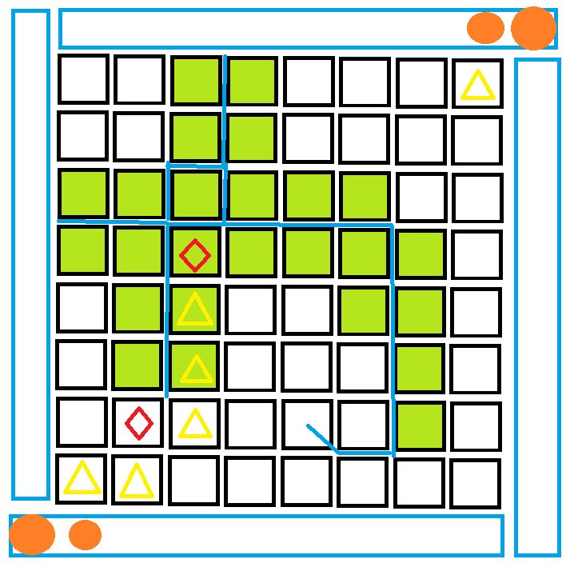

# 展风华·为人先 半命题软件设计大赛策划

## （标题未定）

## 一.  概要

1. 主要内容： *生物，进化，生态系统*

2. 实现形式： web网页设计开发 -> 网页游戏 -> *知识科普*

3. 对题目的阐释

    蓝色底色，代表外围的海洋，绿色的竖和勾代表大地，黄点代表生物，海洋带来了大陆，大陆和海洋哺育着动物，动物们支撑联系着大陆和海洋。在游戏中，玩家将会感受到生态系统的构成，物种之间合作与敌对等关系，物竞天择，适者生存，游戏中假想的大陆将会被最适应合作与对抗的玩家统一。

## 二. 核心游戏
1. 地图： 外围是海洋，中间是大陆，棋盘格与格之间会有河流，河流边缘有草地，拐的边附近的格子为高山。

2. 两位玩家轮流行动，海洋动物会自动移动，玩家可以选择操作自己所有可动的生物。当一位玩家占领了超过半数的草地，游戏胜利。 

3. 每位玩家一开始会拥有一个单细胞（海洋）生物，然后可以通过升级获得食草动物，食草动物可升级为食肉动物,以下是三种动物的介绍。

    a. 海洋动物只会在海里，其移动时为向目标格子繁殖，即在目标格子里放置新的海洋生物。海洋生物移动向大陆时，会在目标格子进化出一个食草动物。（海洋生物与陆地生物的联动）。

    b. 食草动物有2点食物，移动到相邻的一格会消耗1点，并将目标格子标记为被己方占领,若此处已经有敌对食草生物，触发（种间竞争）。除非在草地或者在有海洋动物的海边，食物将不会自动补充。
    
    c. 食草动物会有以下可选的行动：食草动物可以攻击其他食草动物，以升级为食肉动物，这个过程无需食物。或者，选择合作协助，将自己的食物分享给目标。当两个食草动物相邻，可以各消耗1点食物，繁殖出新的食草动物。当食草动物没有食物，其进入濒死状态，濒死状态最多维持一个回合（每个回合结束时结算濒死状态），超过一回合其死亡。

    d. 食肉动物会有5点食物，移动一格消耗1点，它可以进入已经有生物的格子，并将其吃掉（或者肉食动物种间竞争），回复相应的食物。肉食动物可以消耗2点食物，用威慑将周围四格全部标记为被己方占领。

## 三. 其他功能

总体上说，核心虽然是上面的游戏，但是这个网站不能仅仅停留在游戏，应该要有其他更有意义的功能。
首页上，设计功能有：游戏入口，账号等网络服务，游戏规则介绍，一个简单的生物学百科，我觉得应该在想一个功能。

1. **百科**：介绍包括游戏中出现的内容科普，图鉴等资料信息，形式暂定。
2. 功能2

## 四. 可行性以及分析

1. 我需要朱江河和我做完规则设计和调试，我搞定游戏核心逻辑。
2. ☆☆☆ *前端界面的设计*，参考网上一些前端，主要搞好网页整体的界面设计。写的话，大家一起学一下这个前端就行。
3. ☆☆ 游戏、百科和功能2部分的内容美工，包括以上游戏的棋子棋盘设计，不需要写实，因为游戏本身就是一个抽象的游戏，主要*美观*，不要和界面总体的风格违和就行。
4. 资料的搜集。
5. 后端，让游戏支持联机对战等网络功能（可选）。
